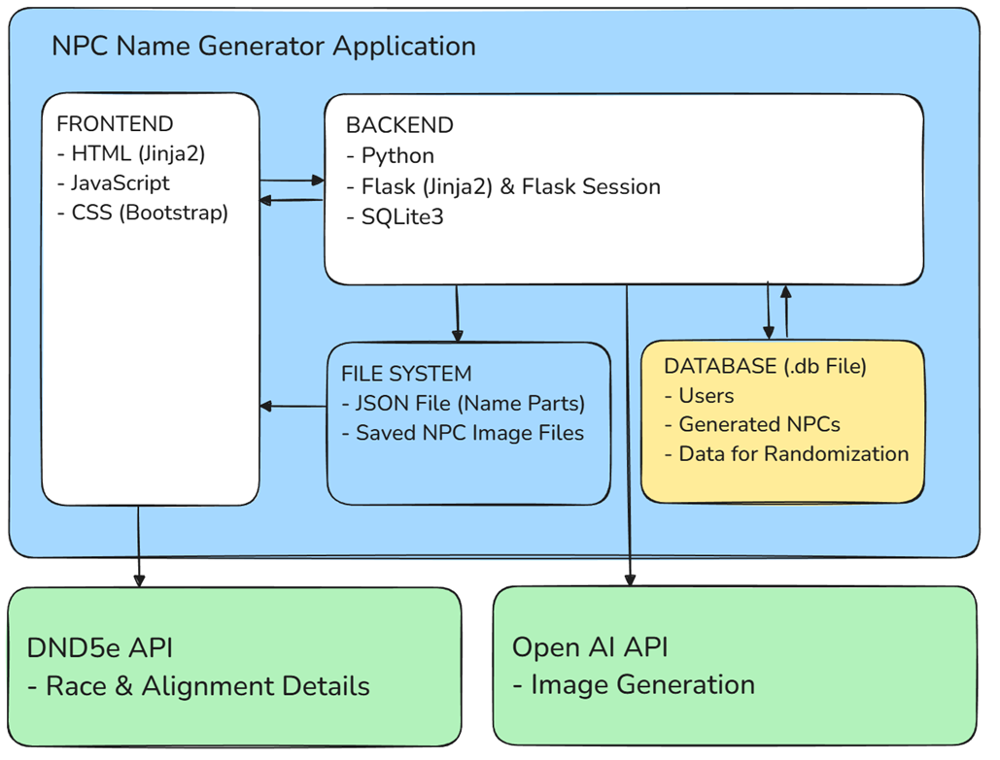

# NPC Generator

## Description
A modular web application for creating, managing, and visualizing non player characters (NPCs) for tabletop role‑playing games specifically for D&D. The tool focuses on structured character creation, flexible randomization, and optional AI‑generated artwork to support world‑building and storytelling.

## Video Demo
https://youtu.be/XoKv6dotPpM

## Deployed Application
https://npc-generator-e3c8dxcvczewcvcy.westeurope-01.azurewebsites.net

Login Credentials:
admin
DPK?jxjH4G!kceTF

Please use responsibly. Image generation creates costs!
---

# Table of Contents

- [Overview](#overview)
    - [Features](#features)
    - [Tech Stack](#tech-stack)
    - [Access & Authentication](#access--authentication)
    - [Secret Handling](#secret-handling)
    - [Data Storage](#data-storage)
    - [Architecture](#architecture)    
- [Application Structure](#application-structure)
    - [Character Creation Modules](#character-creation-modules)
    - [Overview Page](#overview-page)
- [Usage](#usage)
- [Files](#files)
- [Limitations & Future Work](#limitations--future-work)

---

# Overview

The Character Generator is a lightweight Flask-based application that allows users to create detailed NPCs through a guided, modular workflow. Characters can be customized manually or generated randomly using curated datasets. Optional portrait images can be created via the OpenAI API.

The goal of the project is to streamline NPC creation for tabletop RPG campaigns by combining structured data, randomization tools, and optional AI artwork.

## Features

- Guided NPC creation across **five structured modules**
- Manual selection or random generation for all attributes
- Category‑based randomization for complex traits
- Locking mechanism to preserve output attributes during randomization
- Integrated **DnD 5e API** for species and alignment information
- Optional portrait generation via **OpenAI (DALL·E 3)**
- Persistent storage of all character data and images
- Clean, responsive UI built with Bootstrap
- Overview page with expandable character details
- Notes field for each character (storage pending)

## Tech Stack

- **Backend:** Python, Flask, Jinja2  
- **Frontend:** HTML, Bootstrap, JavaScript  
- **Database:** SQLite  
- **External APIs:**  
  - DnD 5e API (species & alignment info)  
  - OpenAI API (DALL·E 3 image generation)  
- **Deployment:** Azure App Service 

## Access & Authentication

A login is required to use the application.

For security reasons, **self‑registration is intentionally disabled**.  
Image generation incurs real API costs, and implementing a full payment system is outside the scope of this project.

- User accounts can only be created by the **admin**.
- Each user only sees and manages **their own NPCs**.
- NPCs are stored with a user ID to ensure data separation.

## Secret Handling

Since the OpenAI API key is sensitive information, it is not part of the code and instead read from an environment variable.

## Data Storage

The application uses **SQLite** as its database.

Stored data includes:
- All character attributes from modules 1–4  
- The generated image path (if applicable)  
- User ID (ownership separation)

The database also contains:
- Tables for all selectable attributes  
- Subcategories for filtering (e.g., traits by alignment)

In the future it is planned to store the database in an external server instead of a file.

Additionally the application stores generated images in the file system on the server.

## Architecture

---

# Application Structure

After login, the app consists of three main areas:

1. **Landing Page**  
   Minimalistic navigation to:
   - Create Character
   - Overview

2. **Character Creation**  
   A five‑module workflow that must be completed in no specific order.

3. **Overview**  
   A list of all NPCs created and saved by the logged‑in user, displayed in an accordion layout.

## Character Creation Modules

### **Module 1: Basic Attributes**
Includes:
- Species  
- Gender  
- Age  
- Alignment  
- Profession  
- Optional: Class  
- Name (manual or generated)

**Name Generator:**  
A custom generator built with a JSON dataset of name fragments.  
Names are assembled dynamically in JavaScript based on species and gender.

**Randomization:**  
Each attribute can be selected manually or generated randomly from the dataset of the sqlite database via dropdown options.

**Info Buttons:**  
For *species* and *alignment*, clicking the info icon opens an offcanvas panel.  
Details are fetched live from the **DnD 5e API** via JavaScript.

### **Module 2: Origin**
Attributes:
- Social class  
- Environment  
- Region  

All can be selected manually or randomized.

### **Module 3: Personality**
Attributes:
- Traits 
- Talent
- Quirk

Because of the large variety, users select a **category** rather than a specific trait, talent or quirk.  
Randomization then pulls from the chosen category via JavaScript.

- **Locking mechanism**:  
    Users can lock each output to keep it while randomizing the rest.
    This allows playful experimentation until the desired combination is found.

Traits are filtered based on alignment (e.g., good vs. evil) and two traits are output.

### **Module 4: Appearance**
Attributes:
- Body shape  
- Look  
- Attitude  
- Style  

Same principle as previous modules:
- Manual selection  
- Random generation  

### **Module 5: Picture (Optional)**
Users may optionally generate a portrait using the **OpenAI API (DALL·E 3)**.

Additional appearance descriptors:
- Hair  
- Skin  
- Unique features  

These are not stored in the database; they exist only to enrich the prompt.

**Process:**
1. User clicks “Generate Image”
2. A prompt is constructed from all previously selected attributes
3. A loading placeholder is shown
4. The generated image is displayed once available
5. Users may regenerate the image as often as they like

### Save Character
Clicking the save button inserts a new npc entry to the database via python sqlite query with all selected attributes (except the additional appearance descriptors from **Module 5**).

The latest generated image is stored on the server, and the file path is saved in the database.

## Overview Page

After saving a character, the user is redirected to the **Overview**.

Features:
- Accordion list of all NPCs of the user
- Full display of all selected attributes
- Display of the stored portrait image
- Info buttons for *age* and *alignment* (DnD 5e API via offcanvas)
- Notes field for personal annotations (save functionality pending)
- Delete button with success confirmation

## Usage 

- Log in using admin-provided credentials
- Navigate to Create Character
- Complete all five modules
- Optionally generate a portrait
- Save the character
- View all NPCs in the Overview
- delete characters as needed

---

## Files

**app.py** 
Is the core backend file. It defines all backend logic for the application including: 

- routing with templating for dynamic HTML-templates with jinja2
- storing, manipulating and retrieving data from npc_gen.db via sqlite3 queries
- login and session handling
- prompt building for API request for image generation
- OPEN AI API request for image generation

**helper.py** 
A backend file for helper functions used in app.py.

**npc_gen.db**
SQLite database storing all data needed for character creation in separate tables. The data is organized by category using IDs and partially references to main categories. Main tables are user/login data and saved NPCs which contain all attributes IDs.

**/templates/apology.html**
Page to be rendered in case of error, e.g. login errors.
 
**/templates/creation.html**
Character creation page
 
**/templates/index.html**
Landing page
 
**/templates/layout.html**
Basic layout with navbar
 
**/templates/login.html**
Login page
 
**/templates/overview.html**
Overview page
 
**styles.css**
CSS file for some minor style adaptions, mainly working with Bootstrap.

**/js/name_gen.js**
JavaScript code for the name generator available in creation.html. 

**/js/overview.js**
JavaScript code needed for the overview page in order to implement a server fetch when a characters delete button is clicked and a DND 5e API fetch for the offcanvas on button click.

**/js/random.js**
JavaScript code needed for the creation page in order to implement all randomizations. It also manages the DND 5e API fetch, when an info button is clicked, and the server fetch when the picture generation button or the save NPC button is clicked.
Also manages the attributes locking mechanism.

**data/name_gen.JSON**
Database file containing nameparts for first and last names, different for every species and gender to be assembled by the namegenerator. 

---
 
## Limitations & Future Work

- Notes field storage not yet implemented
- No self‑registration for users
- Image generation depends on external API availability
- Attribute datasets may be expanded or adapted in future updates